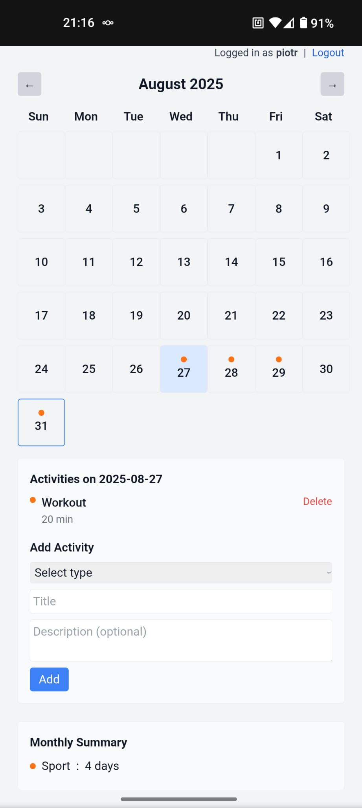

I'm using portainer to directly deploy from github repository (Create stack -> Repository).

The app contains default user __demouser__ with password __nobloat__
The database is stored inside a volume and will be created the first time the app runs.
To add user change the code and redeploy or use sqlite3 from inside the backend container.

Screenshot from app on mobile

